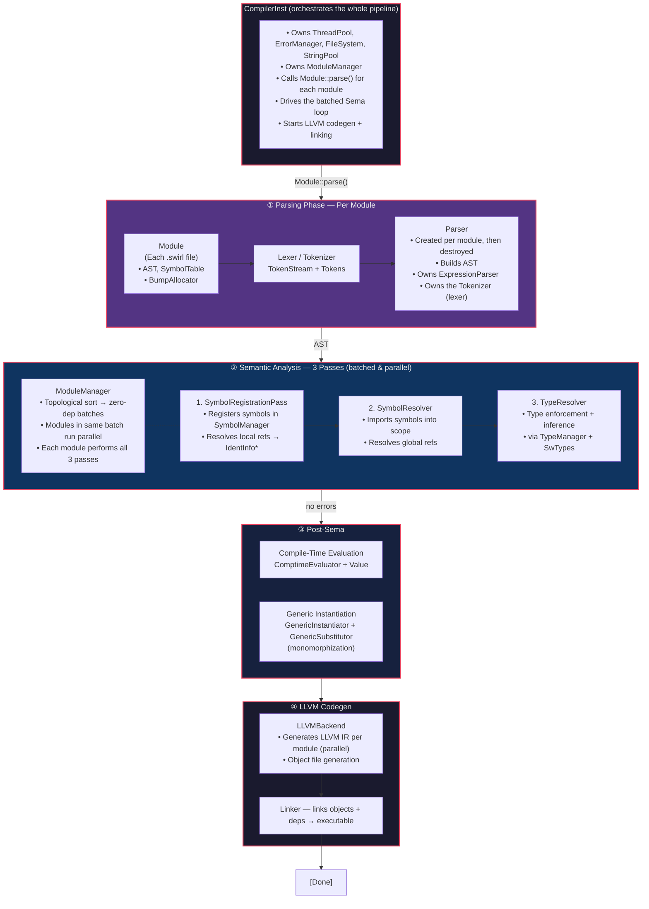

# Swirl Programming Language
Swirl is a statically and strongly-typed, systems programming language, leveraging the LLVM Infrastructure for optimal native code generation.

[Website](https://swirl-lang.netlify.app) |
[Docs](https://swirl-lang.netlify.app/docs) |
[Contributing](./CONTRIBUTING.md)  

<!---->

## Compiler Architecture Overview
The following text is a brief on the compilation pipeline of the Compiler (details are skipped):
- [`CompilerInst`](https://github.com/SwirlLang/Swirl/blob/main/compiler/include/CompilerInst.h): the entry point, this class represents a single contained instantiation of the Compiler, owning resources which are shared across all aspects of a project's compilation.  

- [`Module`](https://github.com/SwirlLang/Swirl/blob/main/compiler/include/modules/Module.h): The compiler implements a typical module system, each Swirl file is treated as a "module" which can control the visibility of the symbols it owns (or imports) to other modules (via the `export` keyword). All modules are owned and managed by an instance of [`ModuleManager`](https://github.com/SwirlLang/Swirl/blob/main/compiler/include/modules/ModuleManager.h) which in turn is owned by `CompilerInst`.  

- [`Parser`](https://github.com/SwirlLang/Swirl/blob/main/compiler/include/parser/Parser.h): responsible for building the Abstract Syntax Tree for modules, a Parser is created for each module and invoked to build its AST, then destroyed. The Parser owns the [lexer (tokenizer)](https://github.com/SwirlLang/Swirl/tree/main/compiler/include/lexer).  

- **Sema (Semantic Analysis):** sema is a multi-pass step, consisting of the following passes:
    - [`SymbolRegistrationPass`](https://github.com/SwirlLang/Swirl/blob/main/compiler/include/sema/SymbolRegistrationPass.h): this pass registers symbols in the [`SymbolManager`](https://github.com/SwirlLang/Swirl/blob/main/compiler/include/symbols/SymbolManager.h) and resolves locally-declared symbol references into their concrete `IdentInfo*`.
    - [`SymbolResolver`](https://github.com/SwirlLang/Swirl/blob/main/compiler/include/sema/SymbolResolver.h): handles bringing imported symbols into a module's scope and resolves all globally-declared symbol references.
    - [`TypeResolver`](https://github.com/SwirlLang/Swirl/blob/main/compiler/include/sema/TypeResolver.h): this is the pass which owns the Type-System's implementation. It enforces type constrains and performs type-inference.

  **Note:** unlike parsing, Sema and the succeeding steps are performed in parallel for all modules which belong in the same "batch", a batch consists of modules which do not depend on each other, this topological sorting is done by the helper class [`ModuleManager`](https://github.com/SwirlLang/Swirl/blob/main/compiler/include/modules/ModuleManager.h) which also keeps ownership of every `Module` object.  

- If no errors were reported in the previous stage, the completion of Sema is followed by a post-sema pipeline which consists of the passes responsible for:
    -  **Compile-Time Evaluation:** evaluates and substitutes all `comptime`-marked constructs. [Resides here](https://github.com/SwirlLang/Swirl/tree/main/compiler/include/comptime).
    - **Generic Instantion:** monomorphizes generic constructs based on the generic arguments passed in their invocation. [Resides here](https://github.com/SwirlLang/Swirl/tree/main/compiler/include/generics).  

- [`LLVMBackend`](https://github.com/SwirlLang/Swirl/blob/main/compiler/include/backend/LLVMBackend.h): this class owns the codegen logic for generating the LLVM IR, since all the needed information to codegen a Module is already built in previous stages, each Module is codegen'ed in parallel.

## Source references

| Component | File |
|---|---|
| CompilerInst | [`compiler/include/CompilerInst.h`](https://github.com/SwirlLang/Swirl/blob/main/compiler/include/CompilerInst.h) |
| ModuleManager | [`compiler/include/modules/ModuleManager.h`](https://github.com/SwirlLang/Swirl/blob/main/compiler/include/modules/ModuleManager.h) |
| Module | [`compiler/include/modules/Module.h`](https://github.com/SwirlLang/Swirl/blob/main/compiler/include/modules/Module.h) |
| TokenStream (Lexer) | [`compiler/include/lexer/TokenStream.h`](https://github.com/SwirlLang/Swirl/blob/main/compiler/include/lexer/TokenStream.h) |
| Tokens | [`compiler/include/lexer/Tokens.h`](https://github.com/SwirlLang/Swirl/blob/main/compiler/include/lexer/Tokens.h) |
| Parser | [`compiler/include/parser/Parser.h`](https://github.com/SwirlLang/Swirl/blob/main/compiler/include/parser/Parser.h) |
| ExpressionParser | [`compiler/include/parser/ExpressionParser.h`](https://github.com/SwirlLang/Swirl/blob/main/compiler/include/parser/ExpressionParser.h) |
| SymbolRegistrationPass | [`compiler/include/sema/SymbolRegistrationPass.h`](https://github.com/SwirlLang/Swirl/blob/main/compiler/include/sema/SymbolRegistrationPass.h) |
| SymbolResolver | [`compiler/include/sema/SymbolResolver.h`](https://github.com/SwirlLang/Swirl/blob/main/compiler/include/sema/SymbolResolver.h) |
| TypeResolver | [`compiler/include/sema/TypeResolver.h`](https://github.com/SwirlLang/Swirl/blob/main/compiler/include/sema/TypeResolver.h) |
| Sema (pipeline orchestrator) | [`compiler/include/sema/Sema.h`](https://github.com/SwirlLang/Swirl/blob/main/compiler/include/sema/Sema.h) |
| SymbolManager | [`compiler/include/symbols/SymbolManager.h`](https://github.com/SwirlLang/Swirl/blob/main/compiler/include/symbols/SymbolManager.h) |
| IdentManager | [`compiler/include/symbols/IdentManager.h`](https://github.com/SwirlLang/Swirl/blob/main/compiler/include/symbols/IdentManager.h) |
| SwTypes | [`compiler/include/types/SwTypes.h`](https://github.com/SwirlLang/Swirl/blob/main/compiler/include/types/SwTypes.h) |
| TypeManager | [`compiler/include/types/TypeManager.h`](https://github.com/SwirlLang/Swirl/blob/main/compiler/include/types/TypeManager.h) |
| ComptimeEvaluator | [`compiler/include/comptime/ComptimeEvaluator.h`](https://github.com/SwirlLang/Swirl/blob/main/compiler/include/comptime/ComptimeEvaluator.h) |
| Value | [`compiler/include/comptime/Value.h`](https://github.com/SwirlLang/Swirl/blob/main/compiler/include/comptime/Value.h) |
| GenericInstantiator | [`compiler/include/generics/GenericInstantiator.h`](https://github.com/SwirlLang/Swirl/blob/main/compiler/include/generics/GenericInstantiator.h) |
| GenericSubstitutor | [`compiler/include/generics/GenericSubstitutor.h`](https://github.com/SwirlLang/Swirl/blob/main/compiler/include/generics/GenericSubstitutor.h) |
| LLVMBackend | [`compiler/include/backend/LLVMBackend.h`](https://github.com/SwirlLang/Swirl/blob/main/compiler/include/backend/LLVMBackend.h) |
| BumpAllocator | [`compiler/include/utils/BumpAllocator.h`](https://github.com/SwirlLang/Swirl/blob/main/compiler/include/utils/BumpAllocator.h) |
| FileSystem | [`compiler/include/utils/FileSystem.h`](https://github.com/SwirlLang/Swirl/blob/main/compiler/include/utils/FileSystem.h) |
| StringPool | [`compiler/include/utils/StringPool.h`](https://github.com/SwirlLang/Swirl/blob/main/compiler/include/utils/StringPool.h) |
| ErrorManager | [`compiler/include/errors/ErrorManager.h`](https://github.com/SwirlLang/Swirl/blob/main/compiler/include/errors/ErrorManager.h) |
| ErrorPipeline | [`compiler/include/errors/ErrorPipeline.h`](https://github.com/SwirlLang/Swirl/blob/main/compiler/include/errors/ErrorPipeline.h) |
| AST Nodes | [`compiler/include/ast/Nodes.h`](https://github.com/SwirlLang/Swirl/blob/main/compiler/include/ast/Nodes.h) |
| AST Visitor | [`compiler/include/ast/Visitor.h`](https://github.com/SwirlLang/Swirl/blob/main/compiler/include/ast/Visitor.h) |
| SourceManager | [`compiler/include/managers/SourceManager.h`](https://github.com/SwirlLang/Swirl/blob/main/compiler/include/managers/SourceManager.h) |
| CLI | [`compiler/include/cli/cli.h`](https://github.com/SwirlLang/Swirl/blob/main/compiler/include/cli/cli.h) |
| Builtins | [`compiler/include/builtins/builtins.h`](https://github.com/SwirlLang/Swirl/blob/main/compiler/include/builtins/builtins.h) |

## Contributing to Swirl
We welcome contributions to Swirl! To start contributing to Swirl, fork the repository, create a new branch, make the changes, and submit a pull request. Read the [Docs](https://swirl-lang.netlify.app/docs) for more info.

## Issues and feature request

If you want to request a new feature or report a bug, you can use the GitHub issues tracker. We will do our best to respond as quickly.
